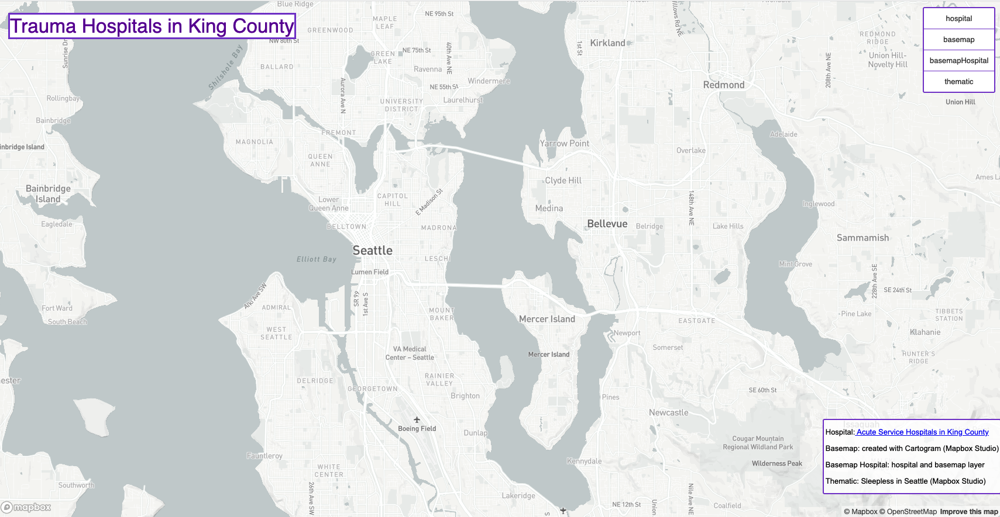
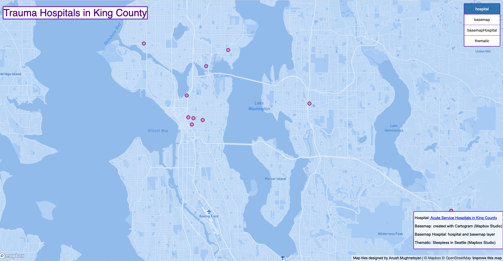
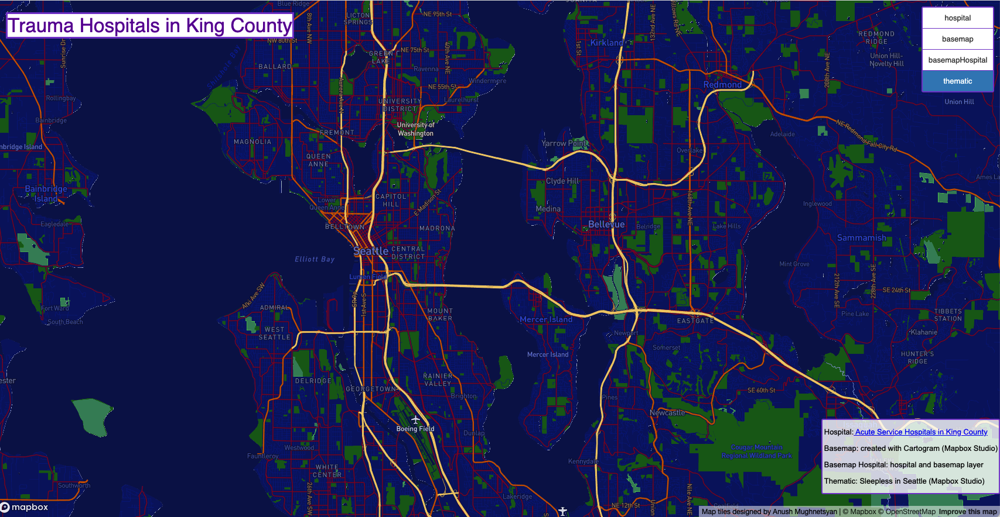

# **QTiles Generation**

## **Trauma Hospitals in King County, WA**
### **Author: Anush Mughnetsyan**

### **Maps**
[Web Map - Seattle Tile Sets](https://anushmr.github.io/QTiles-Generation/index.html) 

Light Basemap by Mapbox

Geospacial dataset with modified monochrom basemap by Mapbox 

Thematic layer created with Cartogram by Mapbox

Combined thematic layer and geospacial dataset

Custom design of Monochrom Midnight basemap by Mapbox

### **Description of Maps**
- I used the greyscale basemap, which is one of the basic  layers by Mapbox, to show the contrast between the rest of all the custom designed maps. 
- All the layers were generated using QGIS QMetaTiles plugins.
- Hospitals layer has simplified Monochrom Sky basemap that hosts all the trauma hospitals in King County, WA.
- Thematic layer was inspired my [Stamen Watercolor basemap](http://maps.stamen.com/#watercolor)
- The next layer is a combination of the thematic and geospacial dataset layers.
- The last layer is custom modified using the Monochrom Midnight basemap by Mapbox. It highlights the artery of roads and bridges across Seattle and King County. I named this layer "Sleepless in Seattle."
- Each layer has zoom layer 0-14

### **Data Sources**

- Mapbox Studio was used for custom design of all the presented layers.
- The data used to make the hospital layer was gathered from
[King County GIS Open Data](https://gis-kingcounty.opendata.arcgis.com/datasets/kingcounty::acute-service-hospitals-in-king-county-hospitals-point/explore?location=47.542492%2C-121.988865%2C10.00)
This dataset presents trauma hospitals across King County, WA for emergency planning and general analysis.
- Watercolor basemap by Stamen was used to create a custom layer in Cartogram by Mapbox
